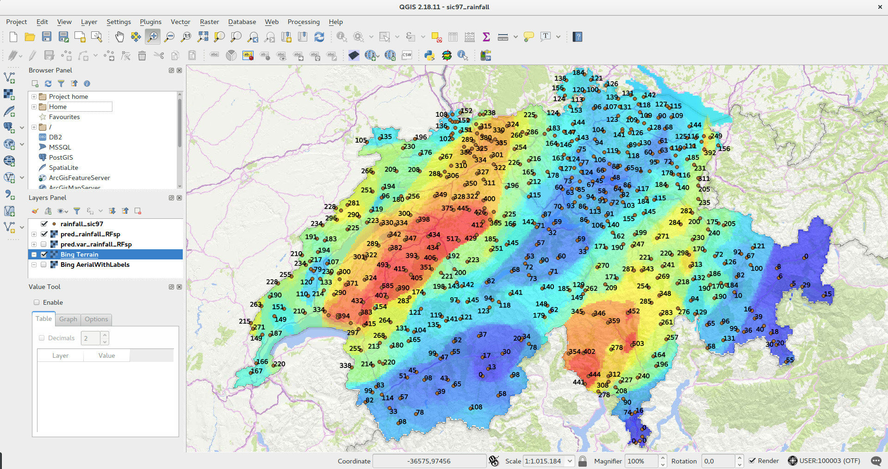

```{r setup, include=FALSE}
knitr::opts_chunk$set(echo = TRUE)
```

| <a href="https://github.com/thengl"></a> | <a href="https://github.com/mnwright"></a>  |
|---|---|

___

<a href="https://creativecommons.org/licenses/by-sa/4.0/" target="_blank"></a>

___

There is an increasing interest in using Machine Learning techniques for the purpose of generating spatial predictions, and for mining environmental data in general. Machine Learning algorithms, such as random forests, artificial neural networks and support vector machines have already shown predictive potential for various environmental applications [@prasad2006newer; @Biau2016; @nussbaum2018evaluation]. This tutorial explains how to use Machine Learning to efficiently generate spatial predictions and derive associated uncertainty. Our focus is on using Random Forest as implemented in the [ranger](https://github.com/imbs-hl/ranger) package [@wright2017ranger], although similar frameworks could be applied to other tree-based Machine Learning algorithms.

For a complete overview of methods used please refer to: Hengl, T., Nussbaum, M., Wright, M. and Heuvelink, G.B.M., 2018. [_"Random Forest as a Generic Framework for Predictive Modeling of Spatial and Spatio-temporal Variables"_](https://peerj.com/preprints/26693/), PeerJ (in review).

## Software installation

Software (required):

*  [R](http://cran.r-project.org/bin/windows/base/) or [MRO](https///mran.microsoft.com/download/);

*  [RStudio](http://www.rstudio.com/products/RStudio/);

*  R packages: GSIF, plotKML, ranger, caret, plyr, raster, devtools (see: [how to install R package](http://www.r-bloggers.com/installing-r-packages/));

* [QGIS](https://www.qgis.org/en/site/forusers/download.html) to visualize predictions (add [WMTS](http://gis.sinica.edu.tw/worldmap/wmts) background layers);

R script used in this tutorial you can download from the **[github](https://github.com/thengl/GeoMLA/tree/master/RF_vs_kriging/R)**. As a gentle introduction to R programming languange and spatial classes in R we recommend following [the Geocomputation with R book](https://geocompr.robinlovelace.net/). To open any spatial layers in QGIS you will need to use rgdal function `writeGDAL` for rasters or `writeOGR` for vector layers.

Quantile regression random forest and derivation of standard errors using Jackknifing is available from ranger version >0.9.4. To run this tutorial it is recommended to install [ranger](https://github.com/imbs-hl/ranger) [@wright2017ranger] directly from github:

```{r, eval=FALSE, echo=TRUE}
devtools::install_github("imbs-hl/ranger")
```

Other packages that we use here include:

```{r, echo=TRUE}
library(GSIF)
library(rgdal)
library(raster)
library(ranger)
quantiles = c((1-.682)/2, 0.5, 1-(1-.682)/2)
## color legend:
leg = c("#0000ff", "#0028d7", "#0050af", "#007986", "#00a15e", "#00ca35", 
        "#00f20d", "#1aff00", "#43ff00", "#6bff00", "#94ff00", "#bcff00", 
        "#e5ff00", "#fff200", "#ffca00", "#ffa100", "#ff7900", "#ff5000", "#ff2800", "#ff0000")
```

## Mapping uncertainty using numeric variables and the ranger package

Consider for example the meuse data set from the [gstat](https://github.com/edzer/gstat) package:

```{r meuse}
demo(meuse, echo=FALSE)
```

We can use number of covariates to help interpolating Zinc variable. We known from the literature that concentration of metals in soil is controlled by river flooding and carrying upstream sediments (it is assumed that the main source of zinc in this case is the river that occasionally floods the area), hence we can add global surface water occurrence [@pekel2016high], the LiDAR-based digital elevation model (http://ahn.nl) and LGN (Landelijk Grondgebruiksbestand Nederland) land cover classes, as potential covariates explaining zinc concentration:

```{r, results=FALSE, tidy=TRUE}
dir.meuse = "../RF_vs_kriging/data/meuse/"
meuse.grid$SW_occurrence = readGDAL(paste0(dir.meuse, "Meuse_GlobalSurfaceWater_occurrence.tif"))$band1[meuse.grid@grid.index] 
## flooding occurrence
meuse.grid$AHN = readGDAL(paste0(dir.meuse, "ahn.asc"))$band1[meuse.grid@grid.index] 
## AHN.nl precise elevation
meuse.grid$LGN5 = as.factor(readGDAL(paste0(dir.meuse, "lgn5.asc"))$band1[meuse.grid@grid.index]) 
## land use class
## convert to indicators:
meuse.grid@data = cbind(meuse.grid@data, data.frame(model.matrix(~LGN5-1, meuse.grid@data)))
```

In addition to the covariate layers, we also derive buffer distances so we can account for the spatial autocorrelation (see the [RFsp tutorial](https://github.com/thengl/GeoMLA)):

```{r bufferdist}
grid.dist0 <- GSIF::buffer.dist(meuse["zinc"], meuse.grid[1], as.factor(1:nrow(meuse)))
```

which takes few seconds as it generates 155 gridded maps. Now that we have prepared all covariates we can fit a spatial prediction model that includes geographical and process-based covariates:

```{r}
fm1 <- as.formula(paste("zinc ~ ", paste(names(grid.dist0), collapse="+"), 
      " + SW_occurrence + dist + ", paste(paste0("LGN5", levels(meuse.grid$LGN5)), collapse = "+")))
fm1
```

this is rather long formula since distance to each sampling point is a separate map. Note also that we use land cover classes `LGN*` as indicators. We can now produce a regression matrix and fit a ranger model by using:

```{r}
rm.zinc1 <- do.call(cbind, list(meuse@data["zinc"], 
                             over(meuse["zinc"], meuse.grid), 
                             over(meuse["zinc"], grid.dist0)))
```

the model shows that this list of predictors accounts for ca 65% of variation in Zinc values based on the Out-of-Bag (OOB) samples [@wright2017ranger]:

```{r}
m1.zinc <- ranger(fm1, rm.zinc1, mtry=22, num.trees=500, 
                   importance="impurity", seed=1, quantreg= TRUE)
m1.zinc
```

Note that we set `quantreg=TRUE` which initiates the Quantile Regression RF approach [@meinshausen2006quantile] and helps us estimate also the prediction error variance i.e. prediction intervals.

Further inspection of the model shows that especially distance to the river and LGN5 class 16, help with predicting zinc concentrations. Nevertheless, it seems that buffer distances are most important for mapping zinc i.e. more important than surface water occurrence, flood frequency, distance to river and elevation for producing the final predictions:

```{r}
xl <- as.list(ranger::importance(m1.zinc))
print(t(data.frame(xl[order(unlist(xl), decreasing=TRUE)[1:10]])))
```

We can now predict median value of Zinc and upper and lower 67% probability prediction intervals (which corresponds to $\pm$1 standard deviation):

```{r}
pred.zinc.rfq = predict(m1.zinc, 
                        cbind(meuse.grid@data, grid.dist0@data), 
                        type="quantiles", quantiles=quantiles)
str(pred.zinc.rfq)
```

where `"quantile= 0.159"` is the lower prediction interval and `"quantile= 0.841"` is the upper prediction interval. For example for prediction location 1 the interval is:

```{r}
pred.zinc.rfq$predictions[1,]
```

which shows that the prediction range is relatively wide (note also that the upper and lower prediction intervals are not necessarily symetric!). We can copy the predicted lower and upper intervals to the spatial object so we can also plot values as maps (maps of predictions can be found in this [tutorial](https://github.com/thengl/GeoMLA)):

```{r}
meuse.grid$zinc_rfq_U = pred.zinc.rfq$predictions[,3]
meuse.grid$zinc_rfq_L = pred.zinc.rfq$predictions[,1]
```

Assuming normal distribution of errors the 67% probability prediction interval should match 1 s.d. of the prediction error:

```{r rfq-histogram, echo=FALSE, fig.width=6, fig.cap="Histogram of s.d. of the prediction error estimated using QRF."}
meuse.grid$zinc_rfq_r = (meuse.grid$zinc_rfq_U - meuse.grid$zinc_rfq_L)/2
hist(meuse.grid$zinc_rfq_r, main="QRF s.d. of prediction errors", col="grey")
```

Compare this numbers with the OOB RMSE and mean s.d. of prediction error:

```{r}
mean(meuse.grid$zinc_rfq_r, na.rm=TRUE); sqrt(m1.zinc$prediction.error)
```

This shows that the mean prediction error is smaller than the OOB RMSE for about 25%, but in general numbers do match.

An alternative approach to estimating the uncertainty of predictions is the Jackknifing approach approach [@wager2014confidence]:

```{r}
m2.zinc <- ranger(fm1, rm.zinc1, mtry=22, num.trees=500, seed=1, keep.inbag=TRUE)
```

Here the `keep.inbag=TRUE` initaties the Jackknifing approach, which estimate standard errors of the expected values of predictions, used to construct confidence intervals. The prediction can be generate by using:

```{r}
pred.zinc.rfj = predict(m2.zinc, cbind(meuse.grid@data, grid.dist0@data), type="se")
str(pred.zinc.rfj)
```

which adds one extra column called `se` i.e. standard errors. If you compare OOB RMSE and mean s.d. of prediction error you will notice that the `se` values are significantly smaller:

```{r}
mean(pred.zinc.rfj$se, na.rm=TRUE); sqrt(m2.zinc$prediction.error)
```

We can *scale* the values of `se` so they reflect the mean RMSE by using:

```{r}
meuse.grid$zinc_rfj_r = pred.zinc.rfj$se * 
    sqrt(m2.zinc$prediction.error)/mean(pred.zinc.rfj$se, na.rm=TRUE)
```

If we plot the two maps of errors next to each other we can see relatively similar patterns:

```{r jacknife-meuse-maps, echo=FALSE, fig.width=9, fig.cap="Comparison of uncertainty maps based on the QRF vs Jackknife approaches for the Meuse data set."}
r.max = quantile(c(meuse.grid$zinc_rfq_r, meuse.grid$zinc_rfj_r), probs=c(0.025, 0.975), na.rm=TRUE)
meuse.grid$zinc_rfq_r = ifelse(meuse.grid$zinc_rfq_r<r.max[1], r.max[1], ifelse(meuse.grid$zinc_rfq_r>r.max[2], r.max[2], meuse.grid$zinc_rfq_r))
meuse.grid$zinc_rfj_r = ifelse(meuse.grid$zinc_rfj_r<r.max[1], r.max[1], ifelse(meuse.grid$zinc_rfj_r>r.max[2], r.max[2], meuse.grid$zinc_rfj_r))
par(mfrow=c(1,2), oma=c(0,0,0,0.5), mar=c(0,0,1.5,1))
par(oma=c(0,0,0,0.5), mar=c(0,0,3.5,1))
plot(raster(meuse.grid["zinc_rfq_r"]), col=rev(bpy.colors())[1:80], main="Prediction error RF quantreg", axes=FALSE, box=FALSE, zlim=r.max)
points(meuse, pch="+")
plot(raster(meuse.grid["zinc_rfj_r"]), col=rev(bpy.colors())[1:80], main="Prediction error RF Jackknife", axes=FALSE, box=FALSE, zlim=r.max)
points(meuse, pch="+")
```

Note how the single isolated outlier in the lower right corner is depicted by the RFsp prediction error map. This single isolated high value of Zinc in that area RFsp has problem explaining as it does not correlate to any covariates, hence the prediction errors will also be high.

Another interesting dataset for comparison of RFsp with linear geostatistical modeling is the Swiss rainfall dataset used in the Spatial Interpolation Comparison (SIC 1997) exercise, described in detail in @dubois2003mapping. This dataset contains 467 measurements of daily rainfall in Switzerland on the 8th of May 1986. Possible covariates include elevation (DEM) and the long term mean monthly precipitation for May based on the CHELSA climatic images [@karger2017climatologies] at 1 km:

```{r}
sic97.sp = readRDS("../RF_vs_kriging/data/rainfall/sic97.rds")
swiss1km = readRDS("../RF_vs_kriging/data/rainfall/swiss1km.rds")
ov2 = over(y=swiss1km, x=sic97.sp)
```

We can fit a RFsp model for this data set using the same approach from above. We first derive buffer distances and create the regression matrix:

```{r}
swiss.dist0 <- GSIF::buffer.dist(sic97.sp["rainfall"], 
                                 swiss1km[1], as.factor(1:nrow(sic97.sp))) 
## takes 1+ mins!
ov.swiss = over(sic97.sp["rainfall"], swiss.dist0)
sw.dn0 <- paste(names(swiss.dist0), collapse="+")
sw.fm1 <- as.formula(paste("rainfall ~ ", sw.dn0, " + CHELSA_rainfall + DEM"))
sw.fm1
ov.rain <- over(sic97.sp["rainfall"], swiss1km[1:2])
sw.rm = do.call(cbind, list(sic97.sp@data["rainfall"], ov.rain, ov.swiss))
```

We can next fit a RFsp model by using (previously fine-tuned RF parameters):

```{r}
m1.rain <- ranger(sw.fm1, sw.rm[complete.cases(sw.rm),], mtry=27, 
                  min.node.size=2, sample.fraction=0.9930754, 
                  num.trees=150, importance = "impurity", seed=1, quantreg=TRUE)
m1.rain
```

which shows that the model explains 83% of variation in the daily precipitation data. Next we predict values and uncertainty by using:

```{r}
rain.rfd1 <- predict(m1.rain, cbind(swiss.dist0@data, swiss1km@data), 
                     type="quantiles", quantiles=quantiles)$predictions
## now more computational...
swiss1km$rainfall_rfd1 = rain.rfd1[,2]
## s.d. of the prediction error:
swiss1km$rainfall_rfd1_var = (rain.rfd1[,3]-rain.rfd1[,1])/2
str(swiss1km@data)
```

```{r, eval=FALSE, include=FALSE}
library(rgdal)
writeOGR(sic97.sp["rainfall"], dsn = "../RF_vs_kriging/results/rainfall/rainfall_sic97.shp", "rainfall_sic97", "ESRI Shapefile")
writeGDAL(swiss1km["rainfall_rfd1"], fname = "../RF_vs_kriging/results/rainfall/pred_rainfall_RFsp.tif", options = c("COMPRESS=DEFLATE"))
writeGDAL(swiss1km["rainfall_rfd1_var"], fname = "../RF_vs_kriging/results/rainfall/pred.var_rainfall_RFsp.tif", options = c("COMPRESS=DEFLATE"))
```

this finally gives:

```{r qrf-sic97-maps, echo=FALSE, fig.width=9, fig.cap="Predictions and prediction errors for the SIC97 data set."}
par(mfrow=c(1,2), oma=c(0,0,0,0.5), mar=c(0,0,1.5,1))
plot(raster(swiss1km["rainfall_rfd1"]), col=leg, 
     main="Random Forest (RF)", axes=FALSE, box=FALSE)
points(sic97.sp, pch="+")
plot(raster(swiss1km["rainfall_rfd1_var"]), col=rev(bpy.colors()), 
     main="Random Forest (RF) prediction error", axes=FALSE, box=FALSE)
points(sic97.sp, pch="+")
```

the map on the right shows that there are specific zones where the uncertainty is particulary high. This
indicates that the RFsp prediction error maps are potentially more
informative than the geostatistical error maps (e.g. UK variance map): it can be used to depict local
areas that are significantly more heterogeneous and complex and that
require, either, denser sampling networks or covariates that better
represent local processes in these areas.


_Figure: SIC97 data set predictions based on RFsp visualized in QGIS._

So in summary: uncertainty of predictions in RF models can be efficiently estimated using either the QRF (prediction intervals) or the Jacknifing approaches (confidence intervals), both are available via the the ranger package [@wright2017ranger]. Prediction intervals should in average match the RMSE estimated using OOB samples or other Cross-validation approaches. Note however that both approaches are computationally intensive and could increase the prediction time at the order of magnitude times. There are additional costs to pay to derive a reliable and detailed measures of uncertainty.

## Mapping prediction errors for factor/binomial variables

In the next example we look at mapping the uncertainty of predictions of factor/binomial variables. Consider for example the soil type classes in the Meuse data set:

```{r}
summary(meuse$soil)
```

We can first look at mapping the occurrence of the class `"1"`:

```{r}
meuse@data = cbind(meuse@data, data.frame(model.matrix(~soil-1, meuse@data)))
summary(as.factor(meuse$soil1))
```

To produce a map of `soil1` using RFsp we have now two options:

- _Option 1_: treat binomial variable as numeric variable with 0 / 1 values (thus a regression problem),
- _Option 2_: treat binomial variable as factor variable with a single class (thus a classification problem),

Both methods are in fact equivalent and should give the same predictions. There will be however some differences in how are the uncertainty maps estimated. In the case of _Option 1_ we fit a similar type of model as in the previous example:

```{r}
fm.s1 = as.formula(paste("soil1 ~ ", 
                  paste(names(grid.dist0), collapse="+"), 
                  " + SW_occurrence + dist"))
fm.s1
rm.s1 <- do.call(cbind, list(meuse@data["soil1"], 
                             over(meuse["soil1"], meuse.grid), 
                             over(meuse["soil1"], grid.dist0)))
```

which gives:

```{r}
m1.s1 <- ranger(fm.s1, rm.s1, mtry=22, num.trees=500, seed = 1, quantreg=TRUE)
m1.s1
```

In the case of _Option 2_ we treat the binomial variable as factor variable

```{r}
rm.s1$soil1c = as.factor(rm.s1$soil1)
summary(rm.s1$soil1c)
```

and the model turns into a classification problem:

```{r}
fm.s1c <- as.formula(paste("soil1c ~ ", paste(names(grid.dist0), collapse="+"), 
                           " + SW_occurrence + dist"))
m2.s1 <- ranger(fm.s1c, rm.s1, mtry=22, num.trees=500, 
                seed=1, probability=TRUE, keep.inbag=TRUE)
m2.s1
```

which shows that the Out of Bag prediction error (classification error) is only 0.06 (this number is in the probability scale). Note that, it is not easy to compare the results of the regression and classification OOB errors as these are conceptually different. Also note that we turn on `keep.inbag = TRUE` so that ranger can estimate the classification errors using the Jackknife-after-Bootstrap method [@wager2014confidence]. `quantreg=TRUE` obviously would not work here since it is a classification and not a regression problem.

We next derive prediction errors for the two options:

```{r}
pred.soil1_rfb = predict(m1.s1, 
                         cbind(meuse.grid@data, grid.dist0@data), 
                         type="quantiles", quantiles=quantiles)
str(pred.soil1_rfb)
```

and copy the values to the spatial object:

```{r}
meuse.grid$soil1_rfq_U = pred.soil1_rfb$predictions[,3]
meuse.grid$soil1_rfq = pred.soil1_rfb$predictions[,2]
meuse.grid$soil1_rfq_L = pred.soil1_rfb$predictions[,1]
meuse.grid$soil1_rfq_r = (meuse.grid$soil1_rfq_U - meuse.grid$soil1_rfq_L)/2
mean(meuse.grid$soil1_rfq_r, na.rm=TRUE); sqrt(m1.s1$prediction.error)
```

Again, QRF error estimates are somewhat smaller than the OOB RMSE. We derive the errors also using the Jacknifing approach:

```{r}
pred.soil1_rfc = predict(m2.s1, cbind(meuse.grid@data, grid.dist0@data), type="se")
meuse.grid$soil1_rfc = pred.soil1_rfc$predictions[,2]
```

which can be scaled to RMSE using:

```{r}
meuse.grid$soil1_rfc_r = pred.soil1_rfc$se[,2] *
  sqrt(m2.s1$prediction.error)/mean(pred.soil1_rfc$se[,2], na.rm=TRUE)
```

We also derive predictions of the binomial variable using the mean estimate (which can be often different from the median estimate!):

```{r}
pred.regr <- predict(m1.s1, cbind(meuse.grid@data, grid.dist0@data), type="response")$predictions
meuse.grid$soil1_rfr <- pred.regr
```

We can finally plot all maps next to each other by using:

```{r binomial-meuse-maps, echo=FALSE, fig.width=9, fig.cap="Comparison of uncertainty maps for a binomial variable based on the QRF vs Jackknife approaches for the Meuse data set."}
r.soil1 = quantile(c(meuse.grid$soil1_rfq_r, meuse.grid$soil1_rfc_r), probs=c(0.025, 0.975), na.rm=TRUE)
meuse.grid$soil1_rfq_r = ifelse(meuse.grid$soil1_rfq_r<r.soil1[1], 
                                r.soil1[1], ifelse(meuse.grid$soil1_rfq_r>r.soil1[2],
                                                   r.soil1[2], meuse.grid$soil1_rfq_r))
meuse.grid$soil1_rfc_r = ifelse(meuse.grid$soil1_rfc_r<r.soil1[1], 
                                r.soil1[1], ifelse(meuse.grid$soil1_rfc_r>r.soil1[2],
                                                   r.soil1[2], meuse.grid$soil1_rfc_r))
par(mfrow=c(2,3), oma=c(0,0,0,0.5), mar=c(0,0,1.5,1))
par(oma=c(0,0,0,0.5), mar=c(0,0,3.5,1))
plot(raster(meuse.grid["soil1_rfq"]), col=leg, main="Predictions soil '1' RF quantreg", axes=FALSE, box=FALSE, zlim=c(0,1))
points(meuse, pch="+")
plot(raster(meuse.grid["soil1_rfc"]), col=leg, main="Predictions soil '1' RF probs", axes=FALSE, box=FALSE, zlim=c(0,1))
points(meuse, pch="+")
plot(raster(meuse.grid["soil1_rfr"]), col=leg, main="Predictions soil '1' RF regr", axes=FALSE, box=FALSE, zlim=c(0,1))
points(meuse, pch="+")
plot(raster(meuse.grid["soil1_rfq_r"]), col=rev(bpy.colors())[1:80], main="Prediction error RF quantreg", axes=FALSE, box=FALSE, zlim=r.soil1)
points(meuse, pch="+")
plot(raster(meuse.grid["soil1_rfc_r"]), col=rev(bpy.colors())[1:80], main="Prediction error RF Jackknife", axes=FALSE, box=FALSE, zlim=r.soil1)
points(meuse, pch="+")
```


Again both approaches to estimating mapping uncertainty give similar patterns: basically transition zones between class 1 and other soil types are most uncertain. Note however that the QRF estimate of the uncertainty (maps on the left) shows much more distinct jumps in values.

## Mapping prediction errors for a factor variable

In the last example we look at how to map uncertainty of predicting factor-type variable:

```{r}
summary(meuse$soil)
```

which has three classes and hence we treat this variable as a classification problem, which also means that we can now only use the Jacknifing approach:

```{r}
fm.s = as.formula(paste("soil ~ ", paste(names(grid.dist0), collapse="+"), 
                        " + SW_occurrence + dist"))
rm.s <- do.call(cbind, list(meuse@data["soil"], 
                            over(meuse["soil"], meuse.grid), 
                            over(meuse["soil"], grid.dist0)))
m.s <- ranger(fm.s, rm.s, mtry=22, num.trees=500, seed=1, probability=TRUE, keep.inbag=TRUE)
m.s
```

this shows that the model is succesful with the OOB prediction error of about 0.09. This number is rather abstract so we can also check what is the actual classification accuracy using hard classes:

```{r}
m.s0 <- ranger(fm.s, rm.s, mtry=22, num.trees=150, seed=1)
m.s0
```

which shows that the classification or mapping accuracy for hard classes is about 90%. We can produce predictions and uncertainty maps by using:

```{r}
pred.soil_rfc = predict(m.s, cbind(meuse.grid@data, grid.dist0@data), type="se")
```

To plot the prediction we can copy the data to a new object:

```{r}
pred.grids = meuse.grid["soil"]
pred.grids@data = do.call(cbind, list(pred.grids@data, 
                                      data.frame(pred.soil_rfc$predictions),
                                      data.frame(pred.soil_rfc$se)))
names(pred.grids) = c("soil", paste0("pred_soil", 1:3), paste0("se_soil", 1:3))
str(pred.grids@data)
```

which gives 6 columns in total: 3 columns for predictions and 3 columns for prediction errors `se`. We can plot the three maps next to each other by using:

```{r factor-meuse-maps, echo=FALSE, fig.width=9, fig.cap="Predictions of soil types for the meuse data set based on the RFsp: (above) probability for three soil classes, and (below) derived standard errors per class."}
par(mfrow=c(2,3), oma=c(0,0,0,0.5), mar=c(0,0,1.5,1))
par(oma=c(0,0,0,0.5), mar=c(0,0,3.5,1))
plot(raster(pred.grids["pred_soil1"]), col=leg, main="soil type '1' RF probs", 
     axes=FALSE, box=FALSE, zlim=c(0,1))
points(meuse["soil"], pch="+")
plot(raster(pred.grids["pred_soil2"]), col=leg, main="soil type '2' RF probs",
     axes=FALSE, box=FALSE, zlim=c(0,1))
points(meuse["soil"], pch="+")
plot(raster(pred.grids["pred_soil3"]), col=leg, main="soil type '3' RF probs",
     axes=FALSE, box=FALSE, zlim=c(0,1))
points(meuse["soil"], pch="+")
plot(raster(pred.grids["se_soil1"]), col=rev(bpy.colors())[1:80], 
     main="prediction error soil type '1' RF", axes=FALSE, box=FALSE, zlim=c(0,.35))
points(meuse["soil"], pch="+")
plot(raster(pred.grids["se_soil2"]), col=rev(bpy.colors())[1:80], 
     main="prediction error soil type '2' RF", axes=FALSE, box=FALSE, zlim=c(0,.35))
points(meuse["soil"], pch="+")
plot(raster(pred.grids["se_soil3"]), col=rev(bpy.colors())[1:80], 
     main="prediction error soil type '3' RF", axes=FALSE, box=FALSE, zlim=c(0,.35))
points(meuse["soil"], pch="+")
```

This shows that some individual points seem to be problematic as they show high errors for at least 2 classes, and also the lower right corner of the study area is in average the most difficult to map.

## Spatial cross-validation

When fitting spatial prediction models one should try as much as possible to use the so-called [spatial cross-validation](https://mlr-org.github.io/mlr/articles/tutorial/devel/handling_of_spatial_data.html) to estimate a 
realistic measure of prediction accuracy. The spatial cross-validation can be run by using for example the mlr package:

```{r}
library(mlr)
spatial.taskmeuse = makeRegrTask(data = rm.zinc1[,c("zinc","SW_occurrence","dist","AHN")], target = "zinc", coordinates = data.frame(meuse@coords))
spatial.taskmeuse
learner.rf = makeLearner("regr.ranger")
library("parallelMap")
parallelStartSocket(parallel::detectCores())
resampling = makeResampleDesc("SpRepCV", fold = 5, reps = 5)
cv.meuse = mlr::resample(learner = learner.rf, task = spatial.taskmeuse, resampling = resampling)
## compare with non-spatial CV:
nonspatial.taskmeuse = makeRegrTask(data = rm.zinc1[,c("zinc","SW_occurrence","dist","AHN")], target = "zinc")
resampling0 = makeResampleDesc("RepCV", fold = 5, reps = 5)
cv.meuse0 = mlr::resample(learner = learner.rf, task = nonspatial.taskmeuse, resampling = resampling0)
parallelStop()
```

This shows that the non-spatial CV (as expected) will result in about 10% lower RMSE (253 vs 264). 
The difference between the spatial vs non-spatial CV will likely be more significant if the points are 
spatially clustered and a strong spatial auto-correlation exists. 

## Summary points

The uncertainty of the predictions of random forest for regression-type
problems can be estimated using several approaches:

-   The Jackknife-after-Bootstrap method (see e.g. @wager2014confidence).

-   The U-statistics approach of @mentch2016quantifying.

-   The Monte Carlo simulations (both target variable and covariates)
    approach of @COULSTON2016189.

-   The Quantile Regression Forests (QRF) method [@meinshausen2006quantile].

The approaches by @wager2014confidence and @mentch2016quantifying
estimate standard errors of the expected values of predictions, used to
construct confidence intervals, while the approaches of @COULSTON2016189
and @meinshausen2006quantile estimate prediction intervals. 
The Quantile Regression Forests (QRF) algorithm estimates the quantiles 
of the distribution of the target variable at prediction points. Thus,
the 0.025 and 0.975 quantile may be used to derive the lower and upper
limits of a symmetric prediction interval.

In summary: spatial prediction of uncertainty for numeric, binomial and factor-type variables is straight forward with ranger: buffer distance and spatial-autocorrelation can be incorporated at once. Compare with geostatistical packages where GLMs with logit link function and/or indicator kriging would need to be used, and which requires that variograms are fitted per class. 

The QRF and Jacknifing approaches give about similar predictions of the uncertainty (similar patterns) but refer to different scales. The QRF approach seems to be somewhat more attractive as it can be used to produce whole distributions of prediction errors (by setting the `quantiles` argument). One should also be careful about the difference between estimating median and mean values (they can often be different!). Also, both the QRF and the Jacknifing approaches can be computational and increase the computational load by order of mangitude, hence plan carefully your analysis and prediction with larger data sets.

## References
